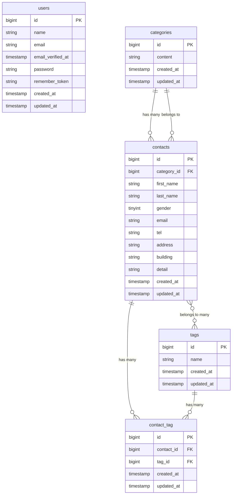

# お問い合わせフォーム（Fashionably Late）

## プロジェクト概要

商品お問い合わせフォームアプリケーションです。

エンドユーザーはお問い合わせ内容を入力し、確認画面を経て送信できます。
管理者はログイン後、管理画面からお問い合わせ一覧の確認、検索、詳細確認、削除、CSVエクスポート、タグ管理を行えます。
また、公開APIとしてお問い合わせの一覧取得、詳細取得、作成、更新、削除機能を提供しています。

---

## 主な機能

- お問い合わせフォーム入力
- お問い合わせ確認画面
- お問い合わせ送信
- サンクスページ表示
- 管理者登録
- 管理者ログイン / ログアウト
- 管理画面でのお問い合わせ一覧表示
- キーワード・性別・カテゴリ・日付による検索
- お問い合わせ詳細表示
- お問い合わせ削除
- CSVエクスポート
- タグ追加
- タグ編集
- タグ削除
- 公開APIによるお問い合わせCRUD

---

## 使用技術

| 項目           | 内容                               |
| -------------- | ---------------------------------- |
| PHP            | 8.2                                |
| Laravel        | 10.x                               |
| データベース   | MySQL 8.4                          |
| Webサーバー    | Nginx                              |
| フロントエンド | Vite / Tailwind CSS 3.4.0          |
| 開発ツール     | Docker / Laravel Sail / phpMyAdmin |

---

## ER図



※ `contact_tag` テーブルは、`contact_id` と `tag_id` の組み合わせをユニーク制約としています。

---

## 環境構築

### 1. リポジトリをクローン

```bash
git clone https://github.com/taka-h8412/contact-form-app.git
cd contact-form-app
```

---

### 2. Composer依存パッケージをインストール

Sailを使用するため、まずDocker経由でComposerを実行します。

```bash
docker run --rm \
    -u "$(id -u):$(id -g)" \
    -v "$(pwd):/var/www/html" \
    -w /var/www/html \
    -e COMPOSER_CACHE_DIR=/tmp/composer_cache \
    laravelsail/php82-composer:latest \
    composer install
```

---

### 3. `.env` ファイルを作成

```bash
cp .env.example .env
```

`.env` のデータベース設定を以下のようにします。

```env
DB_CONNECTION=mysql
DB_HOST=mysql
DB_PORT=3306
DB_DATABASE=laravel
DB_USERNAME=sail
DB_PASSWORD=password
```

---

### 4. Sailを起動

```bash
./vendor/bin/sail up -d
```

---

### 5. アプリケーションキーを生成

```bash
./vendor/bin/sail artisan key:generate
```

---

### 6. マイグレーションとシーディングを実行

```bash
./vendor/bin/sail artisan migrate --seed
```

---

### 7. フロントエンド依存パッケージをインストール

```bash
./vendor/bin/sail npm install
```

---

### 8. Vite開発サーバーを起動

```bash
./vendor/bin/sail npm run dev
```

※ 別ターミナルで実行し、このコマンドは起動したままにしてください。
CSSが反映されない場合は、Vite開発サーバーが起動しているか確認してください。

---

## 開発環境URL

| 項目                 | URL                       |
| -------------------- | ------------------------- |
| お問い合わせフォーム | http://localhost/         |
| 管理者登録           | http://localhost/register |
| 管理者ログイン       | http://localhost/login    |
| 管理画面             | http://localhost/admin    |
| phpMyAdmin           | http://localhost:8080     |

---

## 管理者ログイン情報

Seederで作成される管理者ユーザーは以下です。

| 項目           | 値               |
| -------------- | ---------------- |
| メールアドレス | test@example.com |
| パスワード     | password         |

---

## APIエンドポイント一覧

| メソッド | エンドポイント               | 概要                 |
| -------- | ---------------------------- | -------------------- |
| GET      | `/api/v1/contacts`           | お問い合わせ一覧取得 |
| GET      | `/api/v1/contacts/{contact}` | お問い合わせ詳細取得 |
| POST     | `/api/v1/contacts`           | お問い合わせ作成     |
| PUT      | `/api/v1/contacts/{contact}` | お問い合わせ更新     |
| DELETE   | `/api/v1/contacts/{contact}` | お問い合わせ削除     |

---

## 作成者

高橋士子
